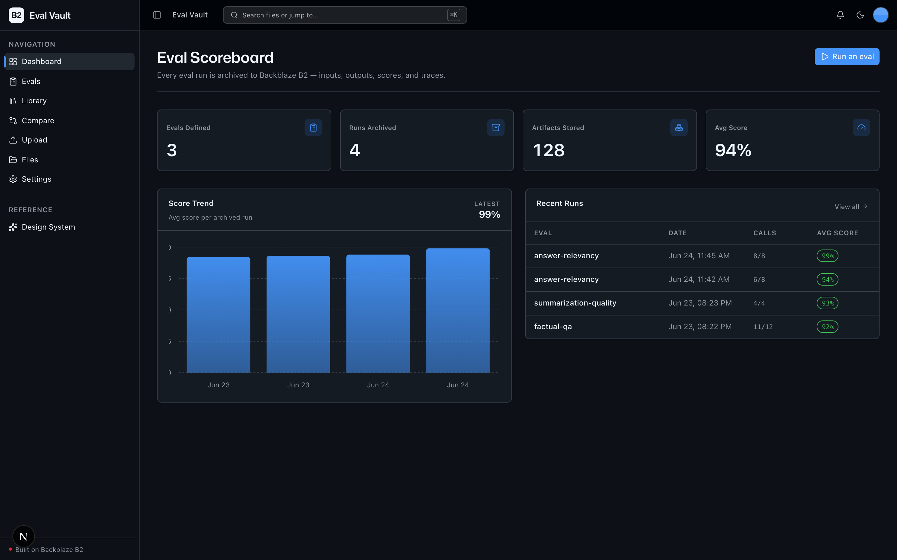
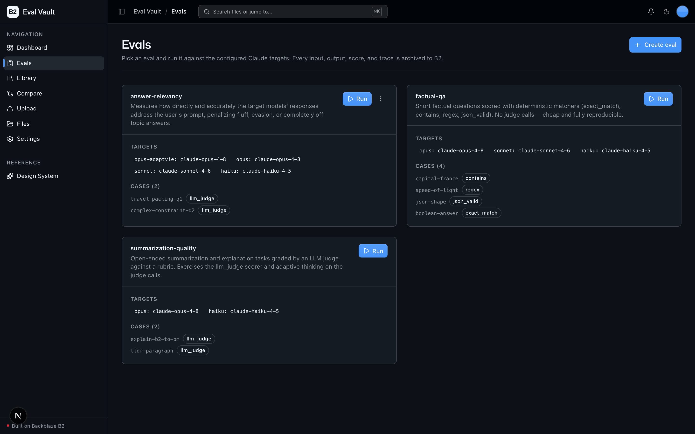
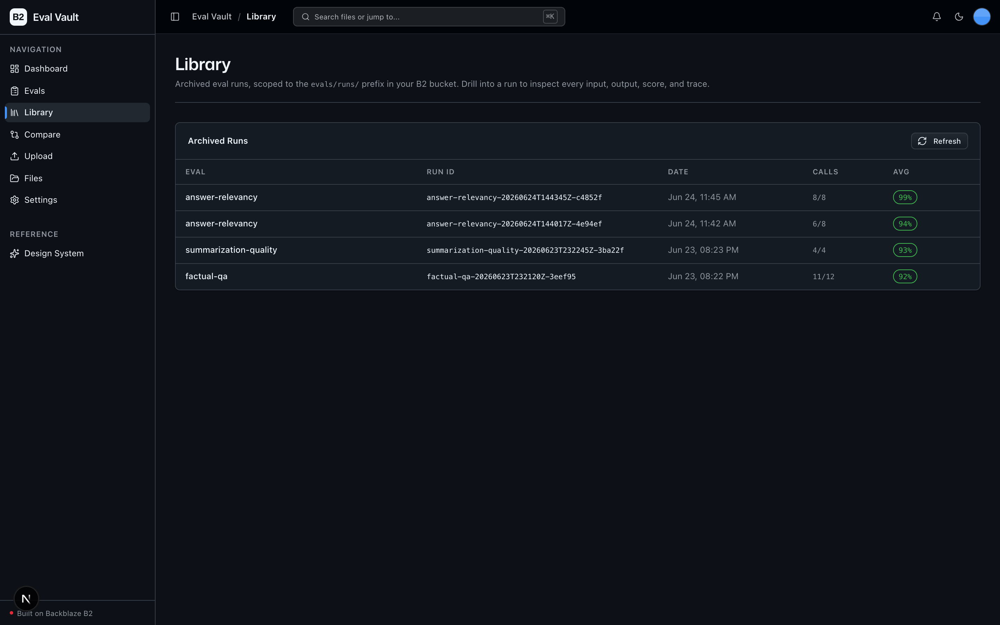
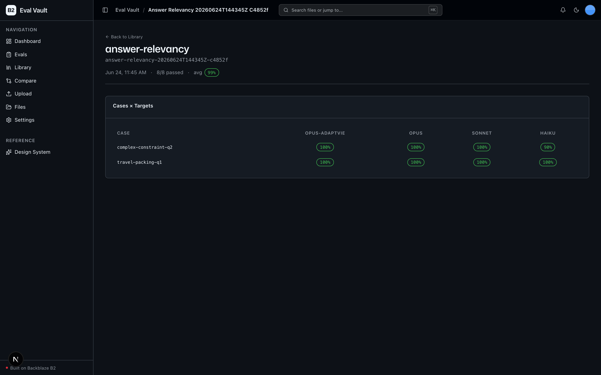
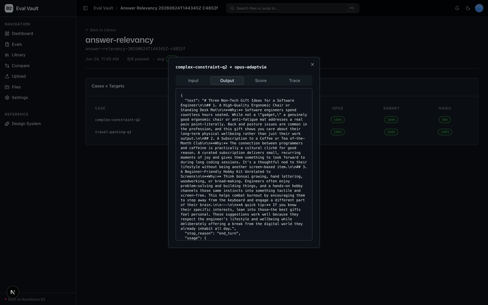
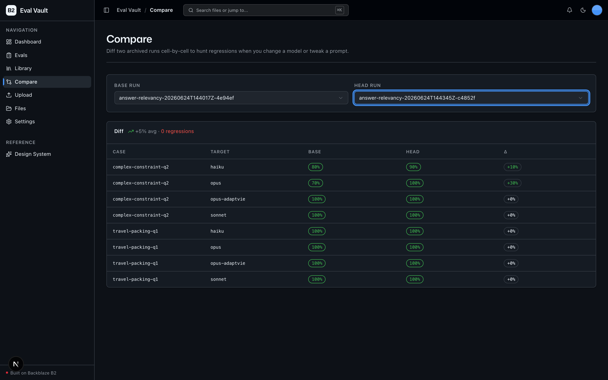

<!-- last_verified: 2026-06-23 -->
# Eval Vault

Turn every LLM eval into a permanent, auditable artifact trail on **[Backblaze B2](https://www.backblaze.com/cloud-storage?utm_source=github&utm_medium=referral&utm_campaign=ai_artifacts&utm_content=b2ai-eval-vault)**.

You define an eval (a YAML file of test cases — prompt + expected behavior + scorer), run it against **N Claude models/configurations**, and every single **input, output, score, and trace** is archived to B2 as a per-run JSON bundle, forever. Later you re-run the same eval against a new model or a tweaked prompt and diff the two runs to hunt regressions.

It is for AI engineers and teams who treat eval results the way ops teams treat logs: **keep everything, query rarely, audit constantly.** That access pattern — a huge volume of small immutable JSON objects, written once and read on demand months later — is the textbook B2 workload.

## What it looks like

**Dashboard** — the Eval Scoreboard: evals defined, runs archived, artifacts stored on B2, average score, a per-run score-trend chart, and recent runs.



**Evals** — the eval definitions, each card showing its Claude targets, cases, and scorers, with a one-click Run.



**Library** — the scoped explorer over the `evals/runs/` prefix in your bucket, listing every archived run with its score.



**Run detail** — drill into a run for the cases × targets score grid; click any cell to inspect its artifacts.



**Artifact viewer** — open a cell to read the archived input, output, score, and trace for that case × target.



**Compare** — diff two archived runs cell-by-cell to hunt regressions after a model swap or prompt change.



**What you get out of the box:**
- Run an eval against multiple Claude models with one click — real Anthropic API calls, real archived artifacts
- Five built-in scorers: `exact_match`, `contains`, `regex`, `json_valid`, and Claude-as-judge (`llm_judge`)
- A scoped **Library** explorer over `evals/runs/` — drill into a run, see the cases × targets score grid, click a cell to read the input / output / score / trace
- **Run comparison** — diff two runs cell-by-cell to catch regressions
- A full **bucket explorer** (`/files`) and upload page for raw objects, plus the design system and layered FastAPI backend from the starter kit

## Architecture at a glance

- **apps/web/** — Next.js 16 + React 19 + Tailwind v4 + shadcn/ui. Dashboard (Eval Scoreboard), Evals, Library, Compare, Upload, Files, Settings.
- **services/api/** — FastAPI, strict layered architecture (`types → config → repo → service → runtime`). The Anthropic SDK lives only in `repo/provider_anthropic.py`; boto3 only in `repo/b2_client.py`. Both rules are enforced by structural tests.
- **Backblaze B2** — the sole data store. Eval run bundles are written under `evals/runs/<run_id>/` via the S3-compatible API.

See [ARCHITECTURE.md](ARCHITECTURE.md) for data flows and the B2 artifact layout.

## Quick Start

You need: Node.js >= 20, pnpm >= 9, Python >= 3.11, a free **[Backblaze B2 account](https://www.backblaze.com/cloud-storage?utm_source=github&utm_medium=referral&utm_campaign=ai_artifacts&utm_content=b2ai-eval-vault)**, and an **Anthropic API key** (for running evals).

**1. Install dependencies**

```bash
pnpm install
```

**2. Set up the backend**

```bash
cd services/api
python -m venv .venv && source .venv/bin/activate
pip install -r requirements.txt
cd ../..
```

**3. Add your credentials**

```bash
cp .env.example .env
```

Open `.env` and fill in (see [the B2 bucket](https://secure.backblaze.com/b2_buckets.htm?utm_source=github&utm_medium=referral&utm_campaign=ai_artifacts&utm_content=b2ai-eval-vault) and [app key](https://secure.backblaze.com/app_keys.htm?utm_source=github&utm_medium=referral&utm_campaign=ai_artifacts&utm_content=b2ai-eval-vault) dashboards):

| Variable | Where it comes from |
|----------|---------------------|
| `B2_APPLICATION_KEY_ID` | B2 application key — keyID |
| `B2_APPLICATION_KEY` | B2 application key — applicationKey (shown once) |
| `B2_BUCKET_NAME` | Your bucket's unique name |
| `B2_REGION` | Your bucket's region, e.g. `us-west-004` (the S3 endpoint is derived as `https://s3.{B2_REGION}.backblazeb2.com`) |
| `ANTHROPIC_API_KEY` | [console.anthropic.com](https://console.anthropic.com) — only needed to run evals |

The bucket explorer and `/health` work without `ANTHROPIC_API_KEY`; it's validated at eval-run time.

**4. Run it**

```bash
pnpm dev
```

Frontend at `localhost:3000`, API at `localhost:8000`. Open **Evals**, pick `factual-qa`, and hit **Run** — the run is archived to B2 and you land on its Library page.

> A full demo run of the two shipped evals is ~12 target calls + ~6 judge calls (a few hundred tokens each) → roughly **$0.10–0.30** end-to-end on blended Claude rates. Well under a dollar.

## Models under test

Default target set (the "N models" axis): `claude-opus-4-8`, `claude-sonnet-4-6`, `claude-haiku-4-5`. Default judge model: `claude-sonnet-4-6`. Target calls run with `thinking` disabled for comparable, cheap answers; `llm_judge` calls use adaptive thinking. Override per target in the eval YAML.

## Core Features

- [Eval Definitions](docs/features/eval-definitions.md) — the YAML format
- [Run an Eval](docs/features/run-eval.md) — execute, score, archive to B2
- [Eval Library](docs/features/eval-library.md) — the scoped `evals/runs/` explorer + artifact viewer
- [Run Comparison](docs/features/run-comparison.md) — regression hunting
- [Scorers](docs/features/scorers.md) — the built-in scorer registry
- [Dashboard](docs/features/dashboard.md) — the Eval Scoreboard
- [File Upload](docs/features/file-upload.md) — upload eval YAMLs / artifacts
- [File Browser](docs/features/file-browser.md) — full bucket explorer
- [Design System](docs/design-system.md) — tokens, primitives, live preview at `/design`

## Tech Stack

- TypeScript, Next.js 16, React 19, Tailwind v4, shadcn/ui, Recharts, TanStack Query
- Python 3.11+, FastAPI, boto3, Pydantic v2, PyYAML, **anthropic**
- Backblaze B2 (S3-compatible object storage)
- pnpm workspaces (monorepo)

## Commands

| Command | What it does |
|---------|-------------|
| `pnpm dev` | Start frontend + backend |
| `pnpm build` | Build frontend |
| `pnpm lint` | Lint frontend |
| `pnpm lint:api` | Lint backend (ruff) |
| `pnpm test:api` | Run backend tests |
| `pnpm check:structure` | Verify layering + SDK-containment rules |
| `pnpm test:e2e` | Playwright e2e tests (run `pnpm --filter @eval-vault/web exec playwright install chromium` once first) |

## Documentation Map

| Doc | Purpose |
|-----|---------|
| [AGENTS.md](AGENTS.md) | Agent table of contents — start here |
| [ARCHITECTURE.md](ARCHITECTURE.md) | System layout, layering, data flows, B2 artifact layout |
| [docs/features/](docs/features/) | Feature docs |
| [docs/app-workflows.md](docs/app-workflows.md) | User journeys |
| [docs/dev-workflows.md](docs/dev-workflows.md) | Engineering workflows and testing |
| [docs/SECURITY.md](docs/SECURITY.md) | Security principles |
| [docs/RELIABILITY.md](docs/RELIABILITY.md) | Reliability expectations |
| [docs/exec-plans/](docs/exec-plans/) | Execution plans and tech debt tracker |

## License

MIT License - see [LICENSE](LICENSE) for details.

## Claude Agent B2 Skill

Manage Backblaze B2 from your terminal using natural language (list/search, audits, stale or large file detection, security checks, safe cleanup).

Repo: [https://github.com/backblaze-b2-samples/claude-skill-b2-cloud-storage](https://github.com/backblaze-b2-samples/claude-skill-b2-cloud-storage)
